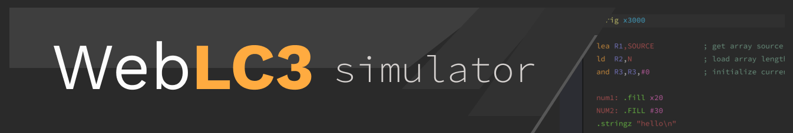

  

## Overview

The Web-based editor and simulator for Little Computer 3 (LC-3) provides a seamless way to write, compile, and execute Assembly programs directly from your browser. WebLC3 comes with a comprehensive suite of accessible tools built in Svelte, and a lightweight assembler and 16-bit processing unit powered by Typescript. WebLC3 optimizes experience for desktop and tablet, and is not suitable for mobile use.

WebLC3 has two main workspaces:  
- On the **editor**, enter or upload your assembly (.asm) code into the primary text editor. Debug your program by hitting *Assemble*. Save your work to your device, and download generated object files (.obj) and symbol tables as desired.   
- On the **simulator**, navigate CPU memory, register, and pointer states with familiar run, step and jump controls. WebLC3 is built to robustly handle input, loops, and value overrides so that you can safely restore your machine on reload or reassembly.


## Run

Once you've installed dependencies with `npm install`, you can use the following command to start a development server for testing:

```bash
npm run dev

# or start the server and open the app in a new browser tab
npm run dev -- --open
```

## Deploying

This section explains how to deploy WebLC3 on a Linux webserver.

### Prerequisites

* git
* curl

### Instructions

You may need to restart your system or shell during this process.

1. Install Node Version Manager (NVM):
    ```bash
    $ curl -o- https://raw.githubusercontent.com/nvm-sh/nvm/v0.37.2/install.sh | bash
    ```

2. Install Node.js version 18.12.1 or newer (latest LTS version recommended):
    ```bash
    $ nvm install 18.12.1
    ```

3. Clone this repository and enter its directory

4. Install dependencies with NPM:
    ```bash
    $ npm install
    ```

5. Build the project for production:
    ```bash
    $ npm run build
    ```

6. Run `server.js` in the background with Node.js:
    ```bash
    $ node ./server.js &
    ```

> You may wish to add a command similar to the above to your `crontab` if you
> want the server to start automatically when you boot up your system.

7. Install Caddy. For operating systems not shown in this step, see
[Caddy's site.](https://caddyserver.com/docs/install)

    > Caddy uses HTTPS automatically, which is required for WebLC3.

    For Debian, Ubuntu, and Raspberry Pi OS, run the following:
    ```bash
    $ sudo apt install -y debian-keyring debian-archive-keyring apt-transport-https
    $ curl -1sLf 'https://dl.cloudsmith.io/public/caddy/stable/gpg.key' | sudo gpg --dearmor -o /usr/share/keyrings/caddy-stable-archive-keyring.gpg
    $ curl -1sLf 'https://dl.cloudsmith.io/public/caddy/stable/debian.deb.txt' | sudo tee /etc/apt/sources.list.d/caddy-stable.list
    $ sudo apt update
    $ sudo apt install caddy
    ```

8. Edit `/etc/caddy/Caddyfile` as root
    * replace `:80` with the desired domain name
    * replace the contents of the block with `reverse_proxy localhost:3000`

9. Restart Caddy:
    ```bash
    $ sudo systemctl restart caddy
    ```

### Verifying deployment

After following the above instructions, WebLC3 should be deployed. You can
verify this by opening a web browser and visiting the web address you expect it
to be available at. Once it is open, you can verify it is working correctly by
clicking `ASSEMBLE` in the bottom right of the page, followed by
`Switch to Simulator`, and `RUN` on the left. The console in the bottom left
should display the following:
```
Hello world!
Halting computer
```
